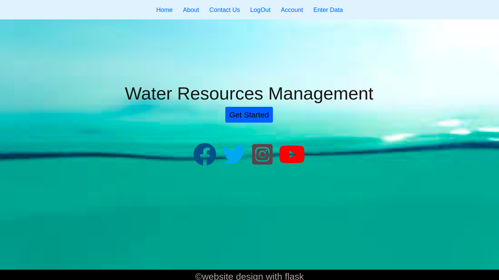
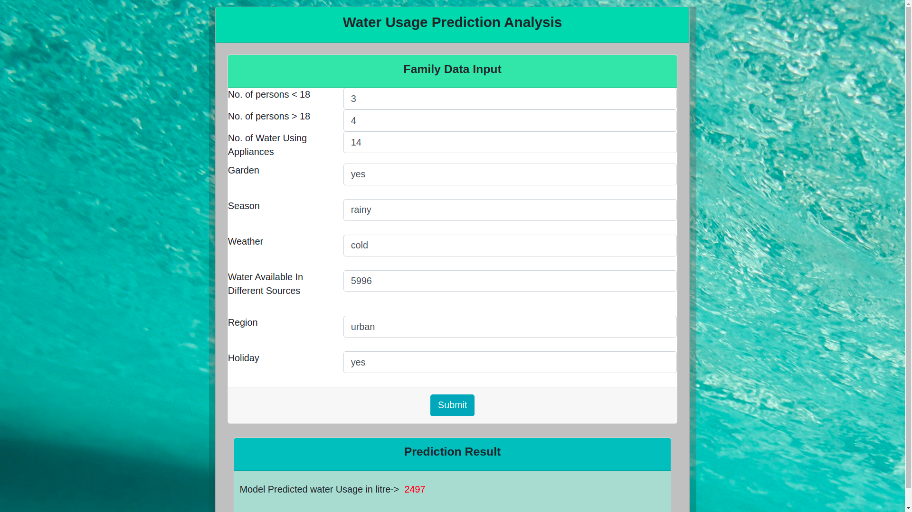

# Project_H2O

## Description
Nowadays the worsening water crisis occurring in many regions has pushed them to the brink of war. Even it is predicted that the next world war might happen on water. Therefore it becomes need of the hour to take appropriate measures for the efficient management of the limited water resources available.

## Inspiration
While thinking about some random Hackathon projects, we somehow ran into the idea of reducing the Water Wastage by tracking the daily usage of households.

## What it Does
So to reduce the inefficient management of water resources, we have built a website which with the help of a ML model predicts the water required by a particular house considering the data provided by the user. Here in our website, we have provided a login and register option where the user can sign up and login to provide the details. On the basis of the data provided, the ML model will allocate the required water to the user along with considering the various factors like weather, season, topography, whether it is a festival day or not, availability of water in the source etc.

## How We Built it
We made this website using HTML, CSS, BootStrap Classes, Ajax, Flask and for the ML Model we used Linear Regression from Scikit-Learn and Pickle to save the Model.
We generated our Random Data to train the ML Model as we didn't find any appropriate data for our project

## Challenges We Ran Into
* Getting Appropriate Data for ML Model
* Deploying and integrating the ML model with the website.
* Due to Version Conflicts of some Python Packages we weren't able to deploy our ML Integrated Website on Heroku
* While Integrating the Payment Option we faced some issues

## Accomplishments that we're Proud of
We're Flattered that our website is not only comprised of some Frontend, Backend, Database part but also it is integrated with ML Model which can track the Water Usage and according to it user can Pay its Water Bill.

## What We Learnt
* How to integrate ML Model with Flask Application
* How to use Stripe Library for Payment Option
* We came across some new Bootstrap classes while building this Project
* How to Ajax Query 
* How to use pickel to Save a ML Model

## What's Next for Project_H2O
Our ideation for this project at this time is limited to the above features. But we can integrate more advanced features which can increase the reliability of the project. This includes:-
•    Consolidating the IoT technology to get the real time data for securing appropriate water supply.
•    Provided a centralized system can help pace of the development of green and brown field smart cities in water supply.
•    This website can be made available on an app which will be compatible both on android and iOS providing a one stop solution to the customers in a hassle free manner.

## Try it Out
As of now it only runs on local boot(http://127.0.0.1:500/) as we were not able to deploy it on Heroku

## ScreenShot of Our Website

You can find more ScreenShots in the Images folder
